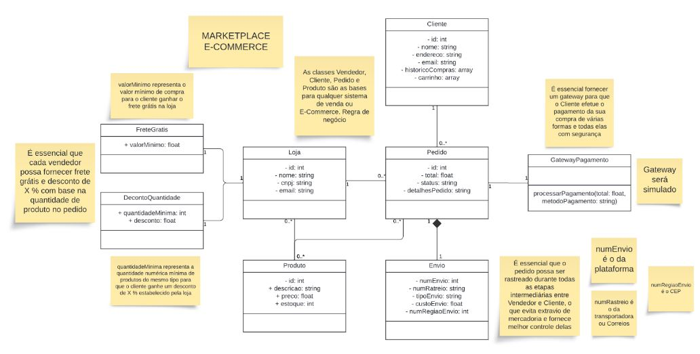

# Documentação API

## API REST de Plataforma E-commerce 
- Versão 1.0
- Engenharia de Software - UFG
- Construção de Software 2024/01

## Entrega da versão revisada do projeto
**Instituto de Informática UFG**

**Professor:** Elias batista Ferreira

**Alunos:**
- Guilherme Gonçalves Dutra de Mendonça
- Felipe Abdiel Brito Gonçalves
- Samuel José Evangelista Alves
- Vitor Martins Castanheira

## Introdução
A API criada visa a possibilidade de movimentações de compra entre cliente e vendedor com todas as funcionalidades básicas necessárias à transação. Dessa forma, utilizamos do conceito CRUD (Create, Read, Update and Delete), assim as movimentações primordiais ao devido funcionamento da API junto ao banco de dados serão possíveis de maneira simples e prática do ponto de vista de desenvolvimento e legibilidade posterior do código. Utilizamos Nodejs para desenvolver a API e MongoDb como banco de dados.

## [Historias de Usuario](arquivosDocumentacao/HistoriasDeUsuario.pdf)

## 

## [Casos de Teste](arquivosDocumentacao/CasosDeTeste.pdf)

## Estratégia de controle de versão
**Ferramenta Utilizada:** Git
**Repositório:** GitHub

**Práticas:**
- **Branches:** 
  - **main:** Branch principal para código pronto para produção.
  - **homologacao:** Branch para desenvolvimento geral e integração contínua.
 - **Commits:** Fazer commits frequentes com mensagens claras e descritivas sobre as mudanças realizadas.
 - **Pull Requests (PRs):** Usar PRs para integrar mudanças de outras branches no main, garantindo que essas mudanças sejam revisadas por outros membros da equipe. 
 - **Fluxo de Trabalho:** 
   - Cada funcionalidade é desenvolvida em uma branch separada (homologacao) e mesclada na branch main após revisão. 
    - Testes unitários são executados localmente antes de integrar as mudanças no repositório principal.

**Configuração de ambiente:** 
 - Cada desenvolvedor usa seu próprio ambiente local com seu computador pessoal.
 - O código fonte é compartilhado entre os membros da equipe usando um repositório Git hospedado no GitHub.
 - Usaremos um arquivo .env para armazenar configurações específicas do ambiente local, como chaves de API e configurações de banco de dados.

## [Endpoints](arquivosDocumentacao/Endpoints.pdf)
